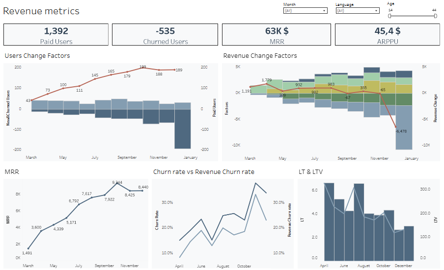

# revenue-metrics-dashboard

# 📊 Revenue Metrics Dashboard (DBeaver & Tableau)

## Overview

This project focuses on building a product analytics dashboard to track revenue dynamics and user behavior in a subscription-based product.

The dashboard enables product managers to monitor key revenue metrics (MRR, Churn, ARPPU) and understand the underlying drivers of revenue and user changes over time.

## Context

The objective was to design a dashboard that helps stakeholders answer:
- How is revenue changing month over month?
- What drives growth or decline in MRR?
- How do user dynamics (new, churned, retained) impact revenue?
- What is the overall health of the product in terms of retention and monetization?

## Data
Source: PostgreSQL database (project schema)

Tables used:
> games_payments

> games_paid_users

Key fields:
- Payment date
- Revenue amount (USD)
- User ID
- Game name
- User attributes (age, language)

## Process
1. Data Preparation (SQL)
- Aggregated revenue to monthly level (MRR logic)
- Built user-level revenue timelines
- Applied window functions (LAG, LEAD) to track user behavior over time

2. Metrics Calculation (SQL + Tableau)

Calculated core product metrics:
  - MRR (Monthly Recurring Revenue)
  - Paid Users
  - ARPPU (Average Revenue Per Paid User)
  - New Paid Users & New MRR
  - Churned Users & Churned Revenue
  - Churn Rate & Revenue Churn Rate
  - Expansion MRR & Contraction MRR
  - Customer Lifetime (LT) & LTV

3. Dashboard Development (Tableau)

Built an interactive dashboard with:
- KPI cards (MRR, Paid Users, ARPPU, Churned Users)
- Revenue and user change factors
- MRR trend over time
- Churn rate vs revenue churn rate
- LT & LTV distribution

Filters:
- Date
- User language
- User age

## Results
*MRR*: 63K$ with overall growth trend

*Paid Users*: 1,392

*Churned Users*: 535

*ARPPU*: $45.4

Key insights:
- Revenue growth is driven primarily by new users and expansion MRR
- Significant revenue drops are linked to churn spikes
- Churn rate fluctuations directly impact revenue stability
- LTV varies significantly across user segments

## Business Insights & Recommendations
- Reduce churn to stabilize revenue (high impact on MRR volatility)
- Focus on expansion strategies (upsell / pricing tiers)
- Monitor reactivation (users returning after churn) as a growth driver
- Segment users by language and age to identify high-LTV groups

## Dashboard

Preview: 

🔗 (https://public.tableau.com/app/profile/anastasiia.shapoval7079/viz/ProjectRevenuemetrics_17762784494110/Dashboard)

## SQL Logic (Core Query)

The dataset for the dashboard was prepared using SQL with window functions:

-- Example: tracking user lifecycle and revenue changes

LAG(payment_month) OVER (PARTITION BY user_id, game_name ORDER BY payment_month)

LEAD(payment_month) OVER (PARTITION BY user_id, game_name ORDER BY payment_month)

📌 Full query available in script.sql

## Skills Demonstrated

SQL • Window Functions • Product Metrics (MRR, Churn, LTV) • Data Visualization • Analytical Thinking

